# otfx

Odin-native terminal text effects. Pipe text in, choose an effect:

```sh
ls -la | otfx decrypt
cat banner.txt | otfx beams
fortune | otfx --random-effect
git log --oneline -10 | otfx matrix
```

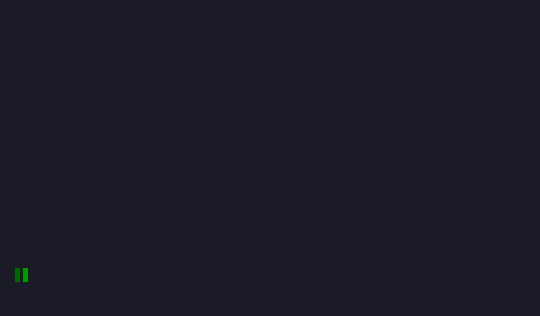

The animation above is generated by `otfx`'s own effect and terminal-cell
renderer, rasterized to GIF by native Odin code with no external image tool. It
animates the Omarchy logo on an 84×13 canvas at 7×13 pixel cells, matching the
upstream `ttfx` gallery's framing so the two are comparable side by side.
`otfx` follows the same effect vocabulary and CLI shape as Rust `ttfx`, but it
is a native Odin implementation with a deliberately different renderer and
direct state machines. It does not claim byte-for-byte terminal-stream parity.

## Why otfx

[`ttfx`](https://github.com/omacom-io/ttfx) is a Rust port of
[TerminalTextEffects](https://github.com/ChrisBuilds/terminaltexteffects).
`otfx` is a second, Odin-native implementation aimed at the same practical
job: a small shell-friendly binary that turns piped text into an animation.

The design is data-oriented from the renderer through the effects:

- `#soa[dynamic]Character` keeps the hot visibility, coordinate, painter-key,
  and visual columns contiguous.
- One engine-owned allocation holds both sides of the terminal cell buffer.
  Effects feed it; no effect owns a second canvas or raster.
- The renderer compares the current and prior cell grids and emits only changed
  terminal runs into one reusable byte buffer.
- Effects use flat `[dynamic]` pools, spans, and `Char_Groups {chars, offsets}`.
  They do not use maps for character state.
- Newer effects evaluate movement, color ramps, and phase state directly from
  dense columns rather than allocating paths, scenes, callbacks, or per-glyph
  objects.
- Geometry and interpolation use Odin's native math/linalg primitives; cyclic
  hot loops use branch wraps or precomputed lookup columns rather than `%`.

## otfx versus ttfx

| | `otfx` (Odin) | `ttfx` (Rust reference) |
|---|---|---|
| Implementation | SoA engine, direct effect phase machines, shared dirty renderer | Per-effect paths/scenes/events and full reference renderer |
| Terminal output | Dirty cell runs only | Reference terminal stream |
| Supported effects | 37 | 37 |
| CLI for shared effects | Same effect names and option names | Reference contract |
| Deterministic seed | `--seed` resets Odin's native RNG | `--seed` resets ttfx's RNG |
| Byte-stream parity | Not a goal yet | Byte-exact against Python TTE |
| Pre-existing SGR/dynamic color modes | Not at reference parity | Supported |
| Terminal resize rebuild | Settled `SIGWINCH` rebuild; inactive for redirected output | Supported |

All 37 reference command names are exposed by `otfx`, including
**`thunderstorm`**. Every implementation is Odin-native.

This is an important distinction: **effect coverage is not byte-stream
parity.** Given the same seed, the two programs may use different random draws,
frame counts, terminal bytes, and intermediate composition while still
producing the same named effect and honoring its supported option surface.

## Performance

[`bench/bench.odin`](bench/bench.odin) runs the real Rust and Odin CLIs with
the same dense 200×50 input, seed, and `--frame-rate 0`. It reports best and
mean wall time, mean child CPU time, a single exact Linux `wait4` peak-RSS
observation, and observed terminal frame markers. This is an end-to-end
production benchmark, not terminal-stream or intermediate-frame parity.

Latest full-suite results: five repeats with `BENCH_MIN_SECONDS=1`, a dense
200×50 input, seed 1, and disabled frame pacing. The aggregation is an
unweighted mean across the 35 fixed-duration effects; Matrix and Thunderstorm
are excluded because their wall-clock duration is configured independently.

| Metric | Rust | Odin | Odin / Rust |
|---|---:|---:|---:|
| Best wall, mean per effect | 238.5 ms | 113.1 ms | 0.47× (2.35× faster) |
| Mean child CPU, mean per effect | 230.3 ms | 105.7 ms | 0.46× |
| Peak RSS, mean per effect | 132.1 MiB | 13.3 MiB | 0.10× |

The harness prints best and mean wall time, child CPU time, peak RSS, and
observed frame markers for every effect. Frame counts are diagnostics rather
than throughput normalizers: the two implementations can construct different
intermediate compositions while honoring the same effect contract.

### Wall-clock-gated effects

`matrix` (`--rain-time`) and `thunderstorm` (`--storm-time`) deliberately run
for a configured interval. With pacing disabled, both use a full CPU core;
their elapsed-time ratio and emitted frames are therefore diagnostics, **not**
normalized throughput or semantic-parity claims.

The following five-repeat diagnostics use `BENCH_MATRIX_RAIN_TIME=5` and the
default `--storm-time 1` at 200×50. CPU is mean child CPU time; peak RSS is
one `wait4` observation. Frame counts are host- and renderer-dependent
observations only.

| Effect | Rust wall / CPU | Odin wall / CPU | Rust / Odin peak RSS | Observed frames, Rust / Odin |
|---|---:|---:|---:|---:|
| Matrix (`--rain-time 5`) | 5,133.5 / 5,110.0 ms | 5,120.0 / 5,096.0 ms | 45.3 / 11.0 MiB | 93,297 / 106,148 |
| Thunderstorm (`--storm-time 1`) | 1,160.6 / 1,146.0 ms | 1,014.2 / 1,004.0 ms | 143.4 / 10.8 MiB | 4,708 / 30,986 |

Different frame counts in the same time window are expected with the two
renderer designs. A speed or parity claim for these effects needs a fixed
logical-frame capture harness; `--virtual-clock` supplies the shared clock half
of that, advancing `--rain-time` and `--storm-time` by logical frames instead
of by wall time, so an unpaced capture no longer depends on host speed.

### Paced 60 fps duty cycle

The default frame rate is 60 fps. The following three-run sample uses the
same dense 200×50 input and seed, with `--rain-time 1` or `--storm-time 1`.
Output is redirected, so these are application-process costs rather than
terminal-emulator costs. CPU is user plus system CPU seconds per run.

| Effect | Rust wall / CPU | Odin wall / CPU | Rust / Odin peak RSS | Interpretation |
|---|---:|---:|---:|---|
| Matrix | 22.29 s / 0.21 s | 21.68 s / 0.14 s | 44.5 / 10.9 MiB | Odin uses about 32% less application CPU at a comparable duration. |
| Thunderstorm | 5.79 s / 0.12 s | 3.83 s / 0.01 s | 135.5 / 10.8 MiB | Lower CPU and RSS, but Odin is 34% shorter; do not treat this as a parity-safe speed win. |

The frame-rate setting is a fixed application target, selected with
`--frame-rate N` (60 by default; `0` disables pacing). Terminal applications
do not have a portable, reliable display-refresh query or a vsynced terminal
output path.

Run the current production benchmark with:

```sh
odin build src -o:speed -out:otfx
odin build bench -o:speed -out:bench/bench
BENCH_MIN_SECONDS=1 ./bench/bench 5
```

The benchmark is entirely Odin; build it once and reuse `bench/bench`. It sets
fixed terminal dimensions for each child process, batches short effects into
multi-second samples, and emits an end-of-run summary of unweighted mean wall
time, child CPU time, peak RSS, and geometric wall-speedup. Matrix and
Thunderstorm are explicitly excluded from that normalized summary.
`BENCH_MATRIX_RAIN_TIME` and `BENCH_STORM_TIME` can shorten their default
5-second and 1-second diagnostic windows.

### Documentation previews

The tracked GIF previews are generated by the standalone Odin tool in
[`tools/docs`](tools/docs). It steps the normal effect and renderer pipeline at
fixed input, seed, canvas, and logical frames; rasterizes native Odin image
pixels; and writes GIF directly. It does not parse terminal output, call an
external image tool, or use the ignored Rust checkout.

Glyphs come from a pinned three-font chain vendored into the ignored
`third_party/fonts`: JetBrains Mono for the terminal identity, DejaVu Sans Mono
for the Latin Extended-B tail that `decrypt` scrambles through, and a katakana
subset of Noto Sans Mono CJK for `matrix`. Together they cover every rune the
effects emit, so nothing renders as tofu. Upstream instead renders SVG through
rsvg and inherits whatever fontconfig finds installed, which is why its
`matrix.gif` needs a system CJK font to come out right.

Block elements and box drawing bypass the font entirely and are filled as exact
cell rectangles. A glyph outline scaled to a 7×13 cell does not reach the cell
edge, which puts seams through solid areas of the logo and breaks `synthgrid`'s
rules into dashes.

```sh
tools/setup/vendor_fonts.sh                             # once
odin build tools/docs -out:tools/docs/render_previews
./tools/docs/render_previews                            # all 37
./tools/docs/render_previews decrypt matrix             # or just these
```

Previews play back in real time: the sampling stride and the GIF frame delay
are derived together from the 60 fps logical clock, so a preview lasts as long
as the effect actually runs.

### Compile time

These are same-host wall times. “Cacheless” means a fresh Rust target directory
or a fresh Odin output path; it does not redownload dependencies. “Repeated”
means the immediate repeat of the same command. Rust reuses compiled artifacts;
Odin's direct build still performs its compilation work. The Rust invalidation
row is one behavior-neutral crate-local constant added after a cached release
build, so it measures a real cached source edit rather than a clean build.

| Build | ttfx Rust debug | ttfx Rust release | otfx Odin debug | otfx Odin release |
|---|---:|---:|---:|---:|
| Cacheless | 4.09 s | 19.32 s | 0.78 s | 6.11 s |
| Repeated | 0.04 s | 0.03 s | 0.77 s | 6.15 s |
| Cached source invalidation | — | 17.54 s | — | — |

The Rust debug cacheless measurement is included for fun as well as the
optimized comparison. These are compile latency samples, not a compiler quality
ranking: toolchains, CPU parallelism, cache state, and dependency graphs differ.

## Effects

`otfx` exposes the same 37 effect commands as `ttfx`. Every one is shown
below, animating the Omarchy logo at seed 3 — all generated by `otfx`
itself, not borrowed from the reference:

### beams


### binarypath

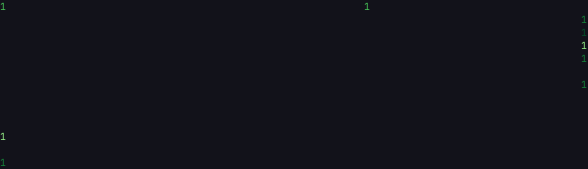

### blackhole

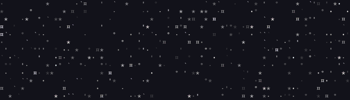

### bouncyballs


### bubbles


### burn

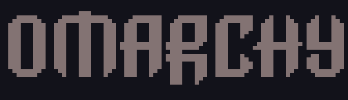

### colorshift

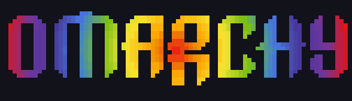

### crumble

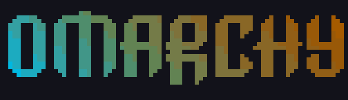

### decrypt


### errorcorrect

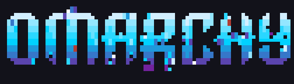

### expand


### fireworks

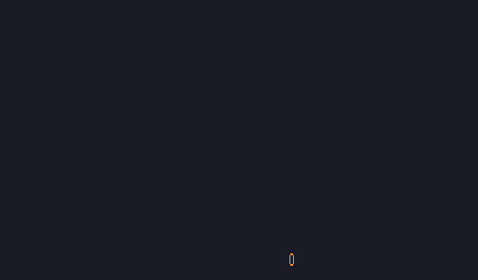

### highlight


### laseretch

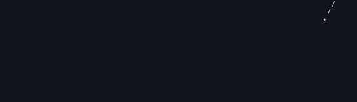

### matrix


### middleout


### orbittingvolley

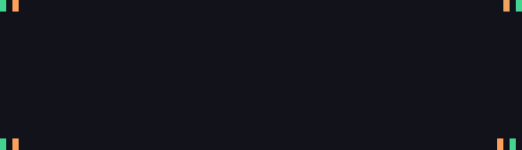

### overflow

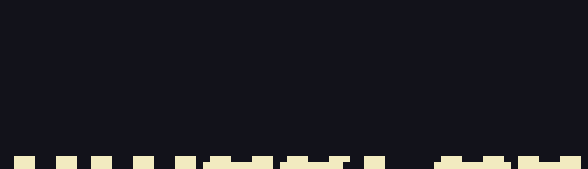

### pour


### print

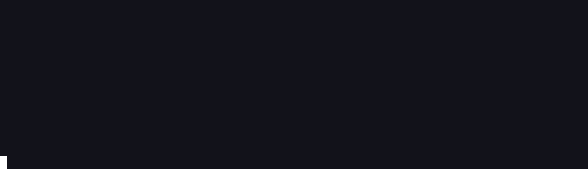

### rain


### randomsequence


### rings

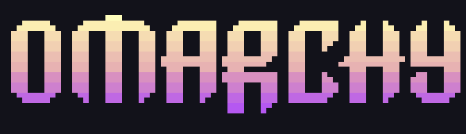

### scattered

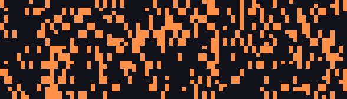

### slice


### slide


### smoke

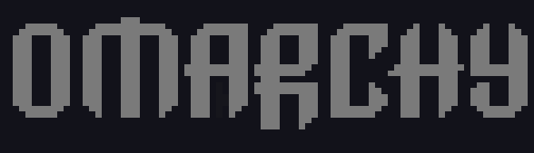

### spotlights

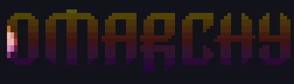

### spray

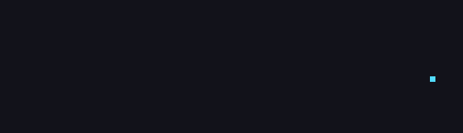

### swarm

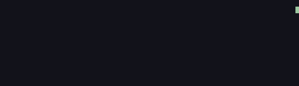

### sweep


### synthgrid

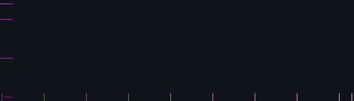

### thunderstorm


### unstable

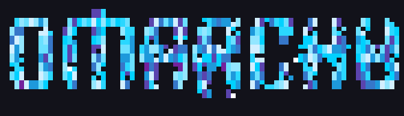

### vhstape

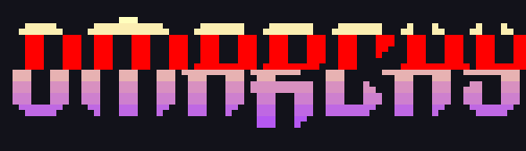

### waves

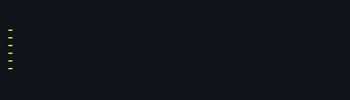

### wipe


Each effect has its own options:

```sh
otfx blackhole --help
otfx matrix --help
otfx bubbles --help
```

## Usage

```text
<producer> | otfx [terminal options] <effect> [effect options]

otfx --help                 # terminal options and all exposed effects
otfx <effect> --help        # options for one effect
```

Terminal options go before the effect name; effect options go after it.

```sh
# terminal options first
printf 'hello\n' | otfx --seed 42 --frame-rate 0 --canvas-width 80 rain

# effect options after the effect
printf 'hello\n' | otfx --seed 42 bubbles --bubble-delay 1 --rainbow

# restrict random selection to a subset
printf 'hello\n' | otfx --seed 42 -R --include-effects wipe sweep

# advance --storm-time/--rain-time by frames, so an unpaced run is reproducible
printf 'hello\n' | otfx --seed 42 --frame-rate 0 --virtual-clock thunderstorm

# install basic shell completion for the current shell session
source <(otfx --print-completion bash)
```

Supported terminal options include canvas sizing/anchoring, wrapping, color
suppression, terminal background color, input-file selection, reproducible
seeds, random-effect filters, shell-completion generation, and frame pacing.
Run `otfx --help` for the authoritative list.

When stdout is an interactive terminal and canvas geometry follows terminal
dimensions, a settled `SIGWINCH` ends the current run, clears its old canvas
area, and rebuilds the engine and effect against the new layout. Redirected
output and `--ignore-terminal-dimensions` deliberately do not install this
interactive behavior. `--reuse-canvas` is honored for the initial run and is
cleared on a resize because that old DEC cursor anchor has just been erased.

## Building and validation

```sh
tools/setup/download_ttfx.sh
third_party/ttfx/bin/build
odin check src
odin build src -o:speed -out:otfx
```

`third_party/` is intentionally ignored. The download script pins the Rust
reference revision used for the published comparison data, applies the tracked
compile compatibility/timing patch, and never replaces a different local
checkout.

The quick supported-effect smoke matrix is:

```sh
for effect in slide beams rings waves matrix decrypt rain wipe scattered expand \
  middleout colorshift highlight sweep randomsequence pour bouncyballs spray \
  slice overflow print errorcorrect unstable smoke burn crumble fireworks \
  spotlights vhstape orbittingvolley synthgrid bubbles binarypath swarm \
  laseretch blackhole thunderstorm
do
  printf 'hello\nworld\n' | COLUMNS=80 LINES=24 \
    ./otfx --seed 42 --frame-rate 0 --max-frames 4 "$effect" >/dev/null
done
```

This validates construction and early-frame execution for every exposed effect.
It does not replace a future parity harness with virtual time and captured
logical frames.

## Remaining parity work

- Build the logical-frame capture harness on top of `--virtual-clock`, then use
  it to reconcile random draw order, phase progression, and terminal output
  where byte parity is wanted. The renderer intentionally has a different
  stream. The shared clock itself is done: `--virtual-clock` makes the two
  seconds-budgeted effects advance by frames, which is what the documentation
  previews already rely on to be reproducible.
- Reconcile paced end-to-end durations effect by effect. Matrix is close in the
  60 fps sample above; Thunderstorm currently ends too early and must not be
  called a parity-safe performance win until corrected.
- Add regression captures for input SGR combinations, xterm-color emission,
  and `always`/`dynamic` behavior across effects.

## Credit and license

The effect ideas, art direction, and CLI contract originate with
[TerminalTextEffects](https://github.com/ChrisBuilds/terminaltexteffects) by
ChrisBuilds, via the vendored Rust `ttfx` reference. `otfx` retains that
attribution while using an independently structured Odin implementation.

MIT licensed; see [LICENSE](LICENSE) and the
[ttfx reference notices](https://github.com/omacom-io/ttfx).
