# otfx

Odin-native terminal text effects. Pipe text in, choose an effect:

```sh
ls -la | otfx decrypt
cat banner.txt | otfx beams
fortune | otfx --random-effect
git log --oneline -10 | otfx matrix
```

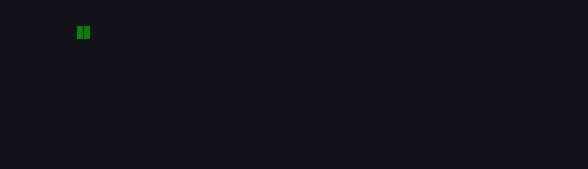

The animation above is generated by `otfx`'s own effect and terminal-cell
renderer, rasterized to GIF by native Odin code with no external image tool. It
animates the Omarchy logo on an 84×13 canvas at 7×13 pixel cells, matching the
upstream `ttfx` gallery's framing so the two are comparable side by side.
`otfx` follows the same effect vocabulary and CLI shape as Rust `ttfx`, but it
is a native Odin implementation with a deliberately different renderer and
direct state machines. It does not claim byte-for-byte terminal-stream parity.

## Why otfx

[`ttfx`](https://github.com/omacom-io/ttfx) is a Rust port of
[TerminalTextEffects](https://github.com/ChrisBuilds/terminaltexteffects).
`otfx` is a second, Odin-native implementation aimed at the same practical
job: a small shell-friendly binary that turns piped text into an animation.

The design is data-oriented from the renderer through the effects:

- `#soa[dynamic]Particle` keeps hot particle columns contiguous.
- Effects publish through `set_particle`, `set_appearance`, and field setters.
  The engine handles clipping, cell ownership, and dirty tracking.
- Persistent row bytes are patched for sparse changes or rebuilt for dense
  changes, then submitted as row slices through `writev`.
- Effects use flat pools, groups, and direct phase machines. They return whether
  a frame is ready; no parallel render-ID list is required.
- Shared Odin math/linalg and SIMD coordinate rounding serve every effect.

## otfx versus ttfx

| | `otfx` (Odin) | `ttfx` (Rust reference) |
|---|---|---|
| Implementation | SoA engine, direct effect phase machines, shared dirty renderer | Per-effect paths/scenes/events and full reference renderer |
| Terminal output | Persistent bytes for dirty rows | Reference terminal stream |
| Supported effects | 37 | 37 |
| CLI for shared effects | Same effect names and option names | Reference contract |
| Deterministic seed | `--seed` resets Odin's native RNG | `--seed` resets ttfx's RNG |
| Byte-stream parity | Not a goal yet | Byte-exact against Python TTE |
| Pre-existing SGR/dynamic color modes | Not at reference parity | Supported |
| Terminal resize rebuild | Settled `SIGWINCH` rebuild; inactive for redirected output | Supported |

All 37 reference command names are exposed by `otfx`, including
**`thunderstorm`**. Every implementation is Odin-native.

This is an important distinction: **effect coverage is not byte-stream
parity.** Given the same seed, the two programs may use different random draws,
frame counts, terminal bytes, and intermediate composition while still
producing the same named effect and honoring its supported option surface.

The original Python TerminalTextEffects implementation is the **accuracy
oracle**; Rust `ttfx` is the **performance oracle**. Visual and behavioral
decisions are checked against Python, while resource comparisons use Rust.
The [37-effect visual review](docs/accuracy-review.md) records sampled behavior,
accepted differences, and remaining coverage limits. Shared ownership and
playback contracts are described in [architecture](docs/architecture.md).

## Performance

The [Spotlights follow-up](docs/spotlights-prepared.md) reduces its runtime by 14%
using prepared HSL colors and squared-distance checks. All 282 captures match
byte-for-byte; the full 35-effect screen found no regression above 2%.

The preceding [37-effect pattern audit](docs/effect-patterns.md) records:
23 effects now apply existing active-list, shared-calculation and held-sample
patterns. The 21 changed finite effects improve 9.5% in mean best wall time.
A [fresh 35-effect ASM comparison](docs/effect-patterns-asm.tsv) measures mean best
wall time of 30.48 ms versus ASM 30.86 ms: roughly parity, with 12/35 individual
wins and a 7.9% slower geometric time ratio.
See the report for CPU/RSS, frame validation and measurement limits.

The earlier row-renderer comparison against **ttfx's ASM branch** measured **48.2 ms
for otfx versus 54.5 ms for ASM**, averaged over 35 finite effects: about 12%
less mean wall time. otfx wins 19/35 effects; geometric mean is essentially tied
at 1.01×, so this is not a uniform advantage.

| Metric, unweighted mean | ttfx ASM | otfx |
|---|---:|---:|
| Best wall time per effect | 54.5 ms | 48.2 ms |
| Child CPU time | 54.5 ms | 48.1 ms |
| Peak RSS per effect | 87.9 MiB | 11.3 MiB |

Against the frozen preceding otfx binary, mean wall time falls from 93.2 to
48.2 ms; 34/35 effects improve. Overflow regresses, and is reported explicitly.
See the [experiment report](docs/row-renderer.md),
[before/after table](docs/row-benchmark.tsv), and
[ASM comparison](docs/row-asm-benchmark.tsv) for every effect and frame count.
The [older non-ASM Rust comparison](docs/rust-benchmark.tsv) is historical.

Measured 2026-09-26 on Ryzen 9 9900X3D, CPU 2, Odin
`dev-2026-09-nightly:a2fb372`, `-o:speed -microarch:native -debug`, with bounds
checks. Dense input and default canvas are 190×46; terminal dimensions are
200×50. Both CLIs use seed 1, frame rate 0, and stdout `/dev/null`. Three samples
batch at least 0.3 seconds each. CPU is child user plus system time from `wait4`.
Frame counts differ for 21/35 ASM comparisons: these are complete animation
costs, not equal-frame throughput. Terminal-emulator work is excluded.

### Reproduce

```sh
odin build src -o:speed -microarch:native -debug -out:otfx
# Default reference is the local non-ASM ttfx binary.
odin build bench -o:speed -out:/tmp/otfx-bench
BENCH_MIN_SECONDS=0.3 taskset -c 2 /tmp/otfx-bench 3
# An exported asm-zen5 binary can be selected without changing third_party.
odin build bench -o:speed -define:REFERENCE_BENCH_BINARY=/path/to/asm-zen5/ttfx -out:/tmp/otfx-asm-bench
TTFX_ASM=force BENCH_MIN_SECONDS=0.3 taskset -c 2 /tmp/otfx-asm-bench 3
```

Use `-define:OTFX_BENCH_BINARY=/path/to/frozen/otfx` to select a frozen candidate.
The report records the ASM revision, binary hashes, and diagnostic commands.

### Timing-gated effects

Matrix (`--rain-time`) and Thunderstorm (`--storm-time`) run for configured
intervals and are excluded from the throughput aggregate. With pacing disabled,
both can use a full CPU core: a faster update loop does more work within the
same time window. Their elapsed times and frame counts are diagnostics.

At the default 60 fps, sleeping adds wall time but no CPU time. Use `--paced`
to measure CPU per animation, CPU duty (CPU/wall relative to one core), peak RSS,
and actual duration. Thunderstorm has independent choreography, so different
animation durations do not establish a throughput speedup. For deterministic
captures, `--virtual-clock` advances the duration gates by logical frames.

### Documentation previews

The tracked GIF previews are generated by the standalone Odin tool in
[`tools/docs`](tools/docs). It steps the normal effect and renderer pipeline at
fixed input, seed, canvas, and logical frames; rasterizes native Odin image
pixels; and writes GIF directly. It does not parse terminal output, call an
external image tool, or use the ignored Rust checkout.

Glyphs come from a pinned three-font chain vendored into the ignored
`third_party/fonts`: JetBrains Mono for the terminal identity, DejaVu Sans Mono
for the Latin Extended-B tail that `decrypt` scrambles through, and a katakana
subset of Noto Sans Mono CJK for `matrix`. Together they cover every rune the
effects emit, so nothing renders as tofu. Upstream instead renders SVG through
rsvg and inherits whatever fontconfig finds installed, which is why its
`matrix.gif` needs a system CJK font to come out right.

Block elements and box drawing bypass the font entirely and are filled as exact
cell rectangles. A glyph outline scaled to a 7×13 cell does not reach the cell
edge, which puts seams through solid areas of the logo and breaks `synthgrid`'s
rules into dashes.

```sh
tools/setup/vendor_fonts.sh                             # once
odin build tools/docs -out:tools/docs/render_previews
./tools/docs/render_previews                            # all 37
./tools/docs/render_previews decrypt matrix             # or just these
```

Previews play back in real time: the sampling stride and the GIF frame delay
are derived together from the 60 fps logical clock, so a preview lasts as long
as the effect actually runs.

### Compile time

These are earlier same-host samples, not rerun for the current source.
“Cacheless” means a fresh Rust target directory
or a fresh Odin output path; it does not redownload dependencies. “Repeated”
means the immediate repeat of the same command. Rust reuses compiled artifacts;
Odin's direct build still performs its compilation work. The Rust invalidation
row is one behavior-neutral crate-local constant added after a cached release
build, so it measures a real cached source edit rather than a clean build.

| Build | ttfx Rust debug | ttfx Rust release | otfx Odin debug | otfx Odin release |
|---|---:|---:|---:|---:|
| Cacheless | 4.34 s | 22.77 s | 0.92 s | 8.83 s |
| Repeated | 0.01 s | 0.02 s | 0.88 s | 8.00 s |
| Cached source invalidation | — | 18.39 s | — | — |

Toolchains, CPU parallelism, cache state, and dependency graphs differ, so these
samples do not establish a compiler quality ranking.

## Effects

`otfx` exposes the same 37 effect commands as `ttfx`. Every one is shown
below, animating the Omarchy logo at seed 3 — all generated by `otfx`
itself, not borrowed from the reference:

### beams

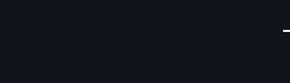

### binarypath

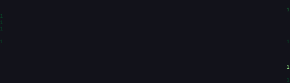

### blackhole

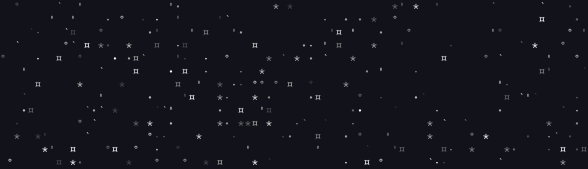

### bouncyballs


### bubbles


### burn

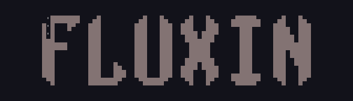

### colorshift

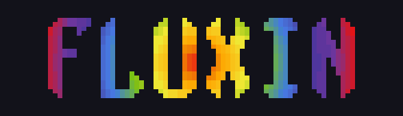

### crumble

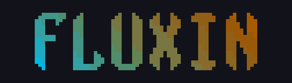

### decrypt


### errorcorrect

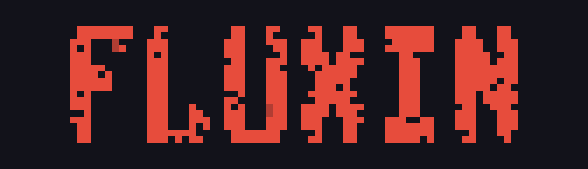

### expand


### fireworks


### highlight

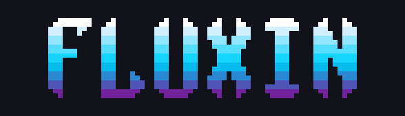

### laseretch

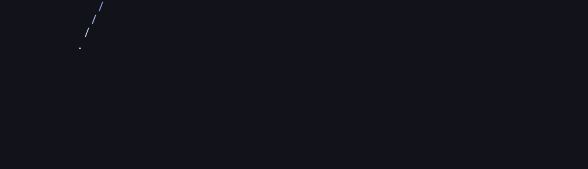

### matrix

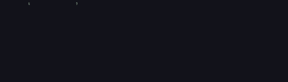

### middleout


### orbittingvolley

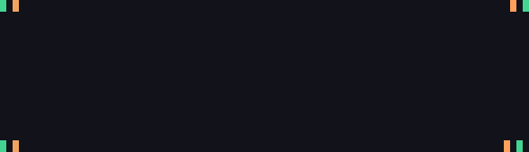

### overflow

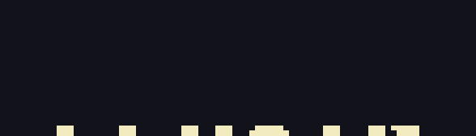

### pour

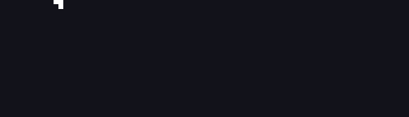

### print


### rain

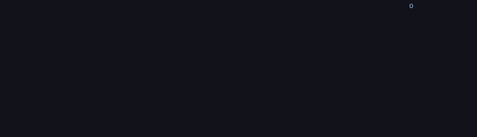

### randomsequence


### rings

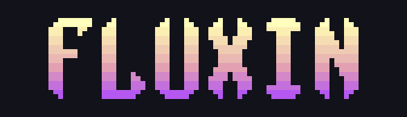

### scattered

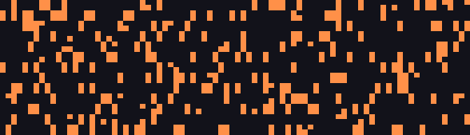

### slice


### slide


### smoke

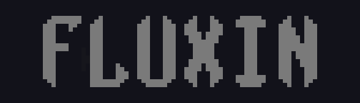

### spotlights

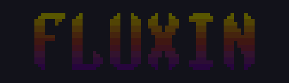

### spray

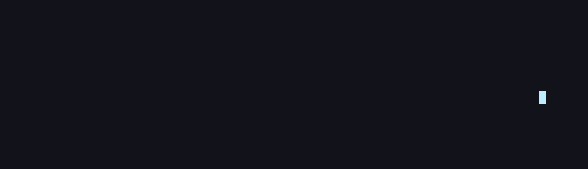

### swarm


### sweep


### synthgrid

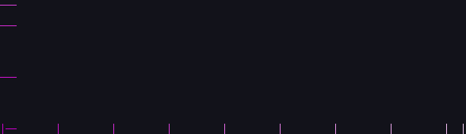

### thunderstorm


Recursive lightning is generated in scalar batches, then flattened for replay.
See the [branch generation and replay contract](docs/architecture.md#thunderstorm).

### unstable

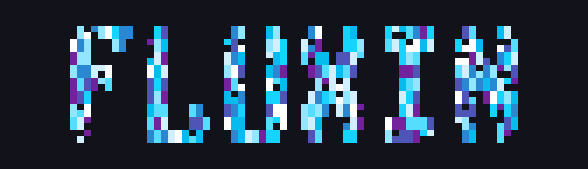

### vhstape

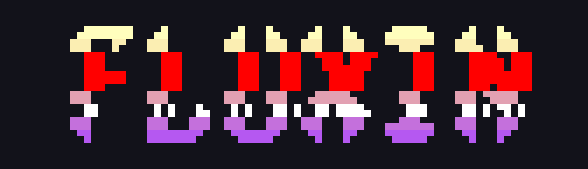

### waves

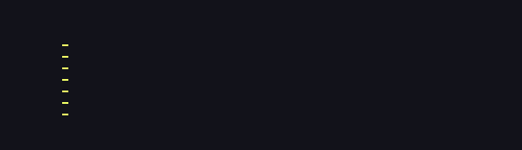

### wipe


Each effect has its own options:

```sh
otfx blackhole --help
otfx matrix --help
otfx bubbles --help
```

## Usage

```text
<producer> | otfx [terminal options] <effect> [effect options]

otfx --help                 # terminal options and all exposed effects
otfx <effect> --help        # options for one effect
```

Terminal options go before the effect name; effect options go after it.

```sh
# terminal options first
printf 'hello\n' | otfx --seed 42 --frame-rate 0 --canvas-width 80 rain

# effect options after the effect
printf 'hello\n' | otfx --seed 42 bubbles --bubble-delay 1 --rainbow

# restrict random selection to a subset
printf 'hello\n' | otfx --seed 42 -R --include-effects wipe sweep

# advance --storm-time/--rain-time by frames, so an unpaced run is reproducible
printf 'hello\n' | otfx --seed 42 --frame-rate 0 --virtual-clock thunderstorm

# install basic shell completion for the current shell session
source <(otfx --print-completion bash)
```

Supported terminal options include canvas sizing/anchoring, wrapping, color
suppression, terminal background color, input-file selection, reproducible
seeds, random-effect filters, shell-completion generation, and frame pacing.
Run `otfx --help` for the authoritative list.

When stdout is an interactive terminal and canvas geometry follows terminal
dimensions, a settled `SIGWINCH` ends the current run, clears its old canvas
area, and rebuilds the engine and effect against the new layout. Redirected
output and `--ignore-terminal-dimensions` deliberately do not install this
interactive behavior. `--reuse-canvas` is honored for the initial run and is
cleared on a resize because that old DEC cursor anchor has just been erased.

## Building and validation

```sh
tools/setup/download_ttfx.sh
third_party/ttfx/bin/build
odin check src
odin build src -o:speed -out:otfx
```

`third_party/` is intentionally ignored. The download script pins the Rust
reference revision used for the published comparison data, applies the tracked
compile compatibility/timing patch, and never replaces a different local
checkout.

The quick supported-effect smoke matrix is:

```sh
for effect in slide beams rings waves matrix decrypt rain wipe scattered expand \
  middleout colorshift highlight sweep randomsequence pour bouncyballs spray \
  slice overflow print errorcorrect unstable smoke burn crumble fireworks \
  spotlights vhstape orbittingvolley synthgrid bubbles binarypath swarm \
  laseretch blackhole thunderstorm
do
  printf 'hello\nworld\n' | COLUMNS=80 LINES=24 \
    ./otfx --seed 42 --frame-rate 0 --max-frames 4 "$effect" >/dev/null
done
```

This validates construction and early-frame execution for every exposed effect.
Regression tests and logical-frame diagnostics are available separately:

```sh
odin test tests
odin build tools/parity -o:speed -out:tools/parity/parity
./tools/parity/parity
```

The diagnostic tool checks Odin completion and final input glyphs and reports
reference frame-count differences without failing on them. Reasonable visual,
RNG, and duration differences are acceptable for meaningful performance gains;
exact reference frames and terminal streams are not acceptance requirements.
[`tools/accuracy`](tools/accuracy) captures paired Python/Odin renderer cells and
contact sheets. The [visual review](docs/accuracy-review.md) records its coverage
and limitations; matching frame counts or final text alone is insufficient.

## Remaining validation work

- Broaden paired Python captures beyond one fixture, seed, and default option set,
  including input SGR, xterm colors, and `always`/`dynamic` behavior.
- Broaden paced CPU measurements independently of unpaced throughput. Matrix and
  Thunderstorm need CPU-duty and duration reporting, not elapsed-time speedups.

## Credit and license

The effect ideas, art direction, and CLI contract originate with
[TerminalTextEffects](https://github.com/ChrisBuilds/terminaltexteffects) by
ChrisBuilds, via the vendored Rust `ttfx` reference. `otfx` retains that
attribution while using an independently structured Odin implementation.

MIT licensed; see [LICENSE](LICENSE) and the
[ttfx reference notices](https://github.com/omacom-io/ttfx).
